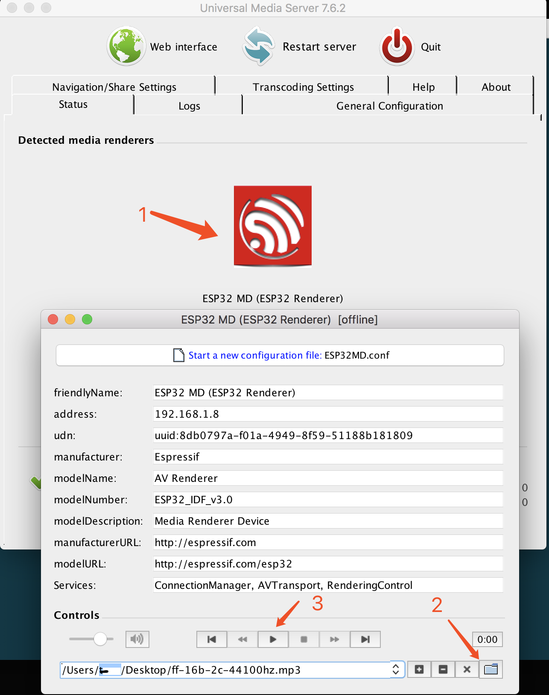
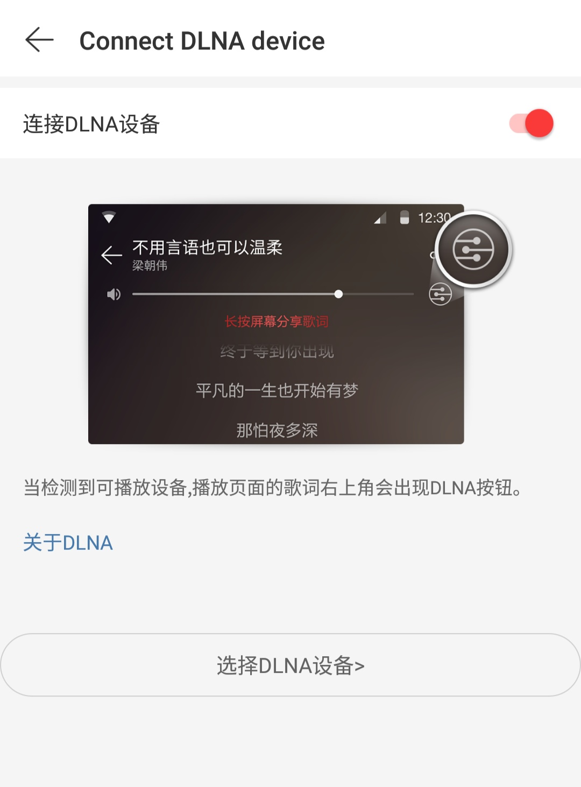

# DLNA Example

This example allows you to run an UPnP/DLNA MediaRenderer in ESP32 with ESP-ADF.

## Compatibility

| ESP32-LyraT | ESP32-LyraTD-MSC | ESP32-LyraT-Mini |
|:-----------:|:---------------:|:----------------:|
|  |  | |
|  |  | |

## Usage

Prepare the audio board:

- Connect speakers or headphone to the board.

Configure the example:

- Select compatible audio board in `menuconfig` > `Audio HAL`.
- Set up the Wi-Fi connection by running `menuconfig` > `Example Configuration` and filling in `WiFi SSID` and `WiFi Password`.
- Make sure the Wi-Fi network is the same with the Computer which runs Media Center (see below).

Configure external application:

For computer:
- Install [Universal Media Center](https://www.universalmediaserver.com/) (or any DLNA Media Control point)
- Select ESP32 Renderer -> Select MP3 file from the computer -> Play, this step is the same as the picture below.

For mobile phone
- Connect the mobile phone to the WiFi network, please make sure that the audio board and the mobile phone connect to the same WiFi network.
- Open a mobile music player, here we take NetEase Music as example, and set up the DLNA status via `Settings` > `Connect DLNA device` >  `ON`, then choose DLNA device for `ESP32 MD(ESP32 Renderer)` in  `Choose device to play`. This step is the same as the picture below.
- Turn on music playback.

Load and run the example.
